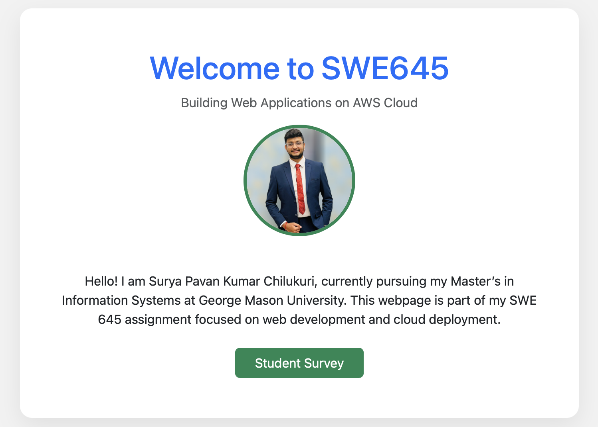
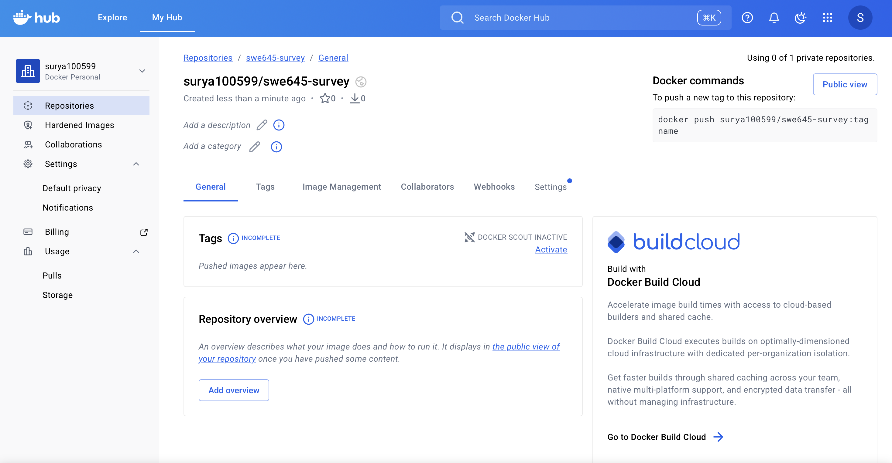
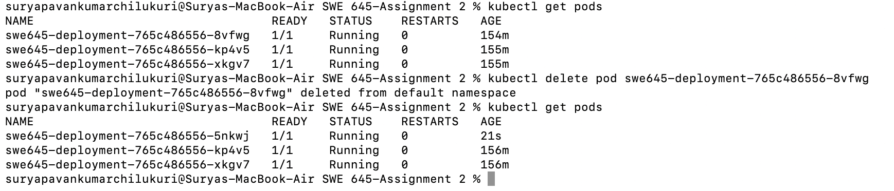

# SWE 645 – Assignment 2

## Containerized Web Application with Kubernetes Deployment and CI/CD Pipeline

---

## 1. Overview

This project demonstrates the implementation of a containerized static web application deployed using Kubernetes with a basic CI/CD pipeline integrated through Jenkins. The assignment extends the functionality of Assignment 1 by incorporating DevOps practices including containerization, orchestration, and automation.

The project includes:

* Static web application (homepage and survey form)
* Docker-based containerization
* Image publishing to Docker Hub
* Kubernetes deployment with multiple replicas
* Service exposure and resiliency validation
* Jenkins pipeline integrated with GitHub

---

## 2. Application Description

The web application consists of:

* **Homepage (index.html):** A class homepage containing personal information and an image
* **Survey Page (survey.html):** A student survey form capturing required inputs
* Navigation between homepage and survey page
* Static assets including profile image

The application is served through an Nginx container.

---

## 3. Docker Implementation

### 3.1 Dockerfile

A Dockerfile was created using the Nginx base image to host the static web application.

### 3.2 Build Docker Image

```bash
docker build -t surya100599/swe645-survey:v1 .
```

### 3.3 Run Container Locally

```bash
docker run -p 8080:80 surya100599/swe645-survey
```

Application verified at:

```
http://localhost:8080
```

### 3.4 Push Image to Docker Hub

```bash
docker push surya100599/swe645-survey:v1
```

Docker Hub repository:

```
https://hub.docker.com/r/surya100599/swe645-survey
```

---

## 4. Kubernetes Deployment

### 4.1 Deployment Configuration

A Kubernetes Deployment was created with:

* 3 replicas
* Container image from Docker Hub
* Label selectors for pod management

Deployment file:

```
k8s/deployment.yaml
```

Deployment command:

```bash
kubectl apply -f k8s/deployment.yaml
```

### 4.2 Service Configuration

A NodePort service was created to expose the application externally.

Service file:

```
k8s/service.yaml
```

Command:

```bash
kubectl apply -f k8s/service.yaml
```

### 4.3 Application Access

Application access verified using port forwarding:

```bash
kubectl port-forward service/swe645-service 8081:80
```

Access URL:

```
http://localhost:8081
```

### 4.4 Resiliency Validation

Resiliency was validated by deleting a running pod:

```bash
kubectl delete pod <pod-name>
```

Kubernetes automatically recreated the pod, confirming self-healing behavior.

---

## 5. CI/CD Pipeline Implementation

### 5.1 Source Control

Project repository:

```
https://github.com/Pavan123ch/swe645-assignment2
```

### 5.2 Jenkins Setup

Jenkins was deployed using Docker and configured locally for pipeline execution.

### 5.3 Pipeline Configuration

A Jenkins pipeline was created that:

* Pulls source code from GitHub
* Executes defined pipeline stages
* Demonstrates CI/CD workflow integration

Pipeline definition stored in:

```
Jenkinsfile
```

Pipeline execution completed successfully.

---

## 6. Project Structure

```
SWE 645-Assignment 2/
│
├── index.html
├── survey.html
├── Profile.jpg
├── Dockerfile
├── Jenkinsfile
├── README.md
└── k8s/
    ├── deployment.yaml
    └── service.yaml
```

---

## 7. Screenshots

### Homepage Running



### Docker Hub Repository



### Kubernetes Pods Running


### Pod Auto-Healing



### Jenkins Pipeline Success


---

## 8. Conclusion

This assignment successfully demonstrates modern DevOps practices including containerization, orchestration, and CI/CD automation. The implementation validates application availability, scalability, and deployment reproducibility using Docker, Kubernetes, and Jenkins.

---

**Author:** Surya Pavan Kumar Chilukuri
**Course:** SWE 645 – Software Engineering for the Web
**Assignment:** Homework Assignment 2
